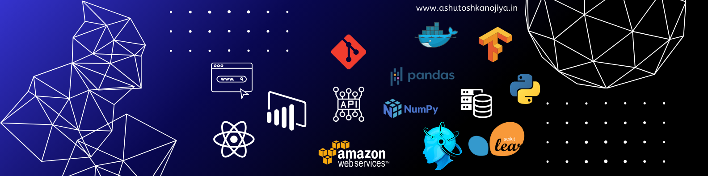

| |   |
|--|--|                          
| <h1>👋 Hi, I'm Ashutosh Kanojiya</h1> | <td rowspan="3"></td>
| I'm a <strong>Senior Software Engineer</strong> with over <strong>5 years of experience</strong> in building scalable, intelligent, and data-driven applications. 
| My passion lies in combining software engineering with data science and AI to deliver impactful solutions.

---

## 💼 Professional Summary

- 🧠 **Expertise in**: Python, Machine Learning, Data Analysis, AI
- 🗃️ Strong with **Databases**: SQL, NoSQL
- ☁️ Hands-on experience with **Cloud platforms**: AWS, Azure
- 📊 Skilled in **Data Visualization**: Tableau, Matplotlib, Seaborn
- 🔗 **API development** with Postman, REST, and GraphQL
- 🛠️ Tools: Git, Jupyter, VS Code, Docker, Postman

---

## 🛠 Tech Stack

| Category       | Tools / Technologies                              |
|----------------|---------------------------------------------------|
| Languages      | Python, SQL, GraphQL                              |
| Libraries      | NumPy, Pandas, Scikit-learn, Matplotlib, Seaborn  |
| Cloud          | AWS, GCP                                           |
| Databases      | MSSQL, MySQL, PostgreSQL, MongoDB, Firebase                        |
| APIs & Tools   | Postman, REST, GraphQL, Git, VS Code                       |
| Visualization  | Tableau, Power BI, Jupyter Notebook               |

---

## 📈 GitHub Stats

<table style="border: 0px;">
  <tr>
    <td style="border: none; vertical-align: top;">
     
    </td>
    <td style="border: none;">
      
    </td>
  </tr>
</table>

---

## 📫 Let's Connect

- 🔗 [LinkedIn](https://linkedin.com/in/ashutosh-kanojiya-44b857178)
- 🌐 [Portfolio / Website](https://ashutoshkanojiya.in/)
- 📧 Email: ashutoshkanojiya1@gmail.com

---

_Thanks for visiting my profile! Feel free to check out my repositories for more content._
